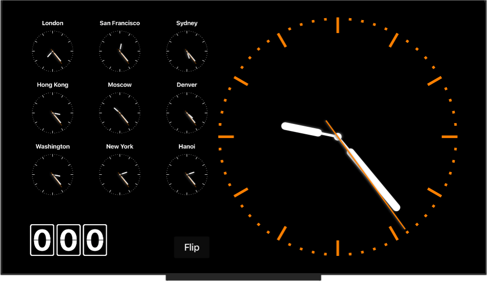

### **ClockTV**

This is a sample project for tvOS ( i.e. the Apple TV ). It requires Xcode 9 and tvOS 11. I noticed when using the Apople TV, that there does not seem to be a clock application for it. I find this quite irritating because often when I am cooking, I watch TV while I'm waiting for something to cook, and I want a mechanism to get timer notifications on my Apple TV. Once this is finished it will handle things like that. Currently the application merely shows a number of clocks. It makes nice use of the Core Animation Framework to animate the various clock hands.

You are welcome to copy or use any of the code in any way you see fit.